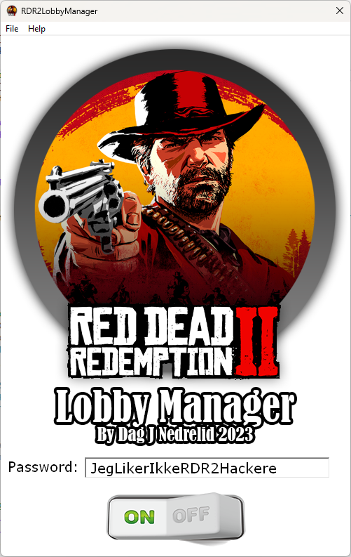

## RDR2LobbyManager

Spill med kun dine venner i RDR2 Online.  

  

Etter at jeg fant ut at en lobby manager på Nexus Mods fungerer bra til formålet og bruker kun en 
tekstfil for å fortelle RDR2 at man vil spille i "invite only" lobby, bestemte jeg meg for å lage 
et eget lite 2MB portabelt verktøy for administrering av denne filen. Programmet ser i registeret 
etter hvor evt. Epic Games eller Steam installasjonen(e) ligger, og lagrer/fjerner deretter en tekstfil 
med navn startup.meta i x64/data mappen(e).  

Tydeligvis er dette etter Rockstar sitt design, da man ved hjelp av denne tekstfilen (som kun har noen 
få XML detaljer i seg) får lov å havne i en unik lobby med alle andre som har samme hash av filen 
(skapes ved å ha unikt passord i samme fil for at den skal være unik og annerledes fra andre folk sin).  

Du trenger IKKE ha programmet kjørende. Bare skriv et passord, slå på knappen, og lukk programmet. Da eksisterer filen som trengs!